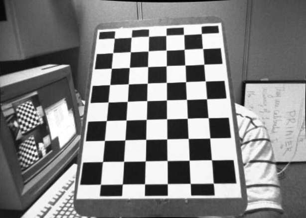
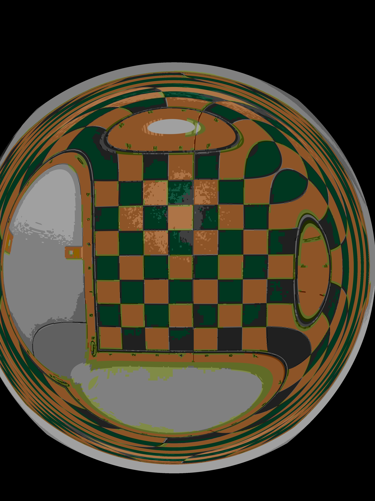

# Calibrador de câmera

Para isntalar os pacotes necessarios:
`./jupyter_install.sh`

No código `calibra.py` defina o caminho do diretório contendo as imagens.

## Execute

`python3 calibra.py`

## Exemplo original:

## Nosso teste

/foto2.jpg "Imagem original - Nosso teste")

## Conclusão

Após analize dos dados, chagamos a conclusão que a camera ue utilizamos é muito nova para esse experimento.